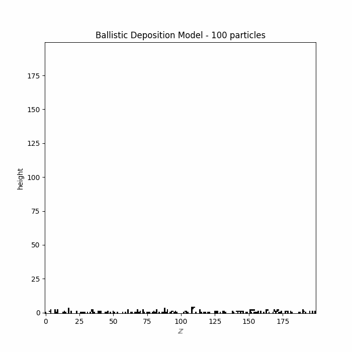

# Simulations of the course Introduction to the KPZ Universality Class

This repository contains simulations based on the lecture notes *"Introduction to the KPZ Universality Class"* by Daniel Remenik.

**Note:** This repository is a work in progress.

**Note:** Some parts of this project, such as code documentation and formatting, have been assisted by LLMs. The code is linted and formatted using [ruff](https://github.com/astral-sh/ruff).
___

## Preview

Below is a preview of one of the simulations. The following GIF illustrates the output of a simulation:

<div style="text-align: center;">
    
</div>

___

## Installation and setup

0. Clone the repository:

```bash
git clone git@github.com:davidnfu0/intro-to-kpz-simulations.git
```

1. *(Optional)* Create a virtual environment, using `venv` or `conda`.

2. Install the required packages using pip:

```bash
pip install -r requirements.txt
```

3. Install the `jupyter` package if you want to run the notebooks in a Jupyter environment:

```bash
pip install jupyter
```

4. *(Optional)* If you want to contribute to the project, you can install `ruff` for linting and formatting:

```bash
pip install ruff
```

You can then run `ruff` to format the code:

```bash
ruff format .
```
___

## Running the simulations
You can run the simulations either in the Jupyter notebooks or directly through the Python scripts provided in each folder. Each file includes a brief description and the necessary code to run the simulation. Parameters for each simulation can be configured within the respective scripts.

To run the python scripts, navigate to the repository folder and execute the following command:

```bash
python -m <simulation_name>
```

For example, to run the deposition model simulation, use:

```bash
python -m deposition_model
```

To run simulations on Google Colab, upload the .py files to your environment and execute them there.
___

## Contributing
Contributions are welcome! Feel free to open an issue or submit a pull request. Contributions may include bug fixes, new features, or documentation improvements.
___

## Future work
1. Add more simulations to the repository.
2. Translate the code into Julia.
3. Add tests.
___
